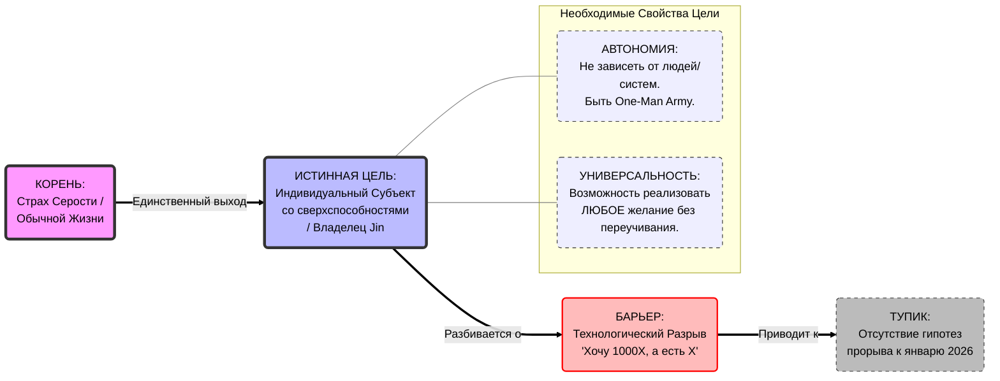

# Ментальная карта психики (v2.2 - Dec 2025)

Эта карта фиксирует 100% истинные аксиомы моего сознания. 
Здесь только проверенные звенья.

## Визуализация (Mermaid)

---

## Расшифровка (Аксиомы)

### 1. КОРЕНЬ: Страх Серости (The Fear)
*   **Суть:** Ужас перед тем, чтобы быть "заменяемым винтиком". Топливо всей системы.

### 2. ИСТИННАЯ ЦЕЛЬ: Владелец Jin (The Sovereign Mage)
*   **Определение:** Состояние обладания Технологическим Рычагом, дающим Автономию и Универсальность.
*   **Свойства:**
    *   **Автономия:** Я не завишу от людей (One-Man Army).
    *   **Универсальность:** Я могу делать всё (наука, бизнес, арт) через Jin.

### 3. БАРЬЕР: Технологический Разрыв (The Tech Gap)
*   **ФАКТ:** Текущие технологии (LLM) имеют потенциал X. Мои амбиции требуют 1000X.
*   **Истина:** Я не верю, что простая настройка/обвязка текущих решений (X) даст мне требуемую мощь (1000X). Разрыв выглядит непреодолимым "здесь и сейчас".

### 4. ТУПИК: Отсутствие Гипотез (The Dead End)
*   **Ситуация:** Я нахожусь во временном убежище (Учеба), но время истекает (Январь 2026).
*   **Проблема:** У меня НЕТ рабочей гипотезы, как превратить X в 1000X или как иначе достичь Цели к этому сроку. Я не вижу Моста.
